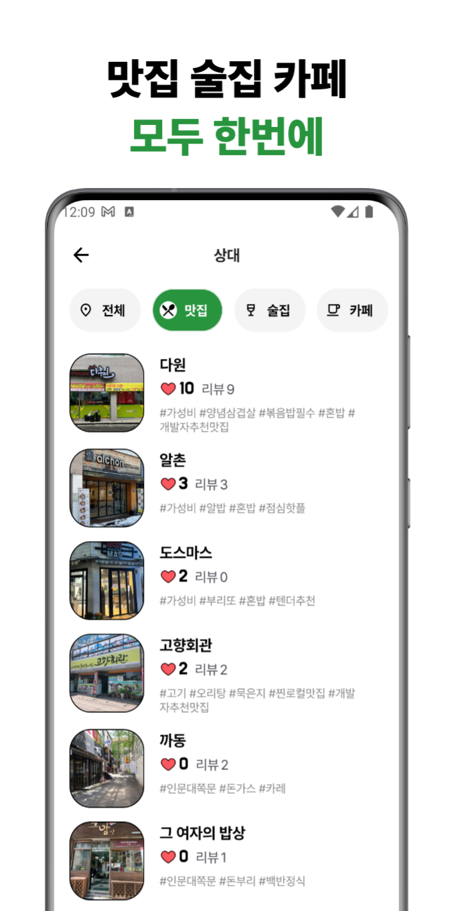
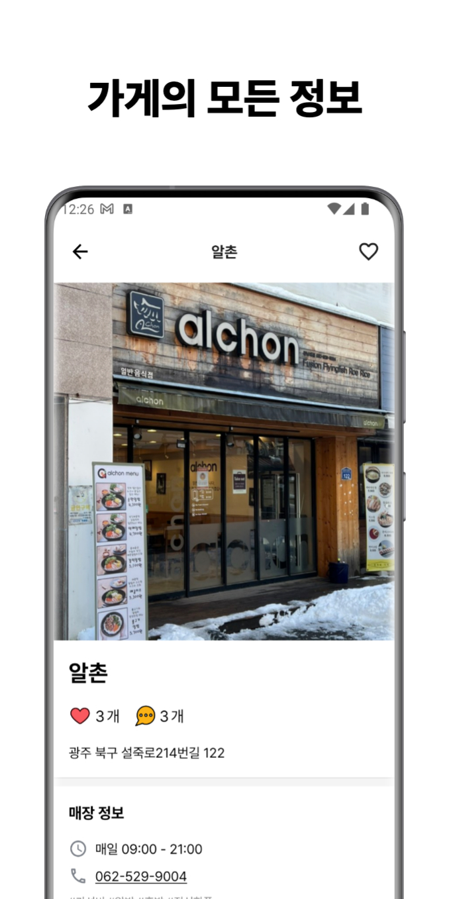
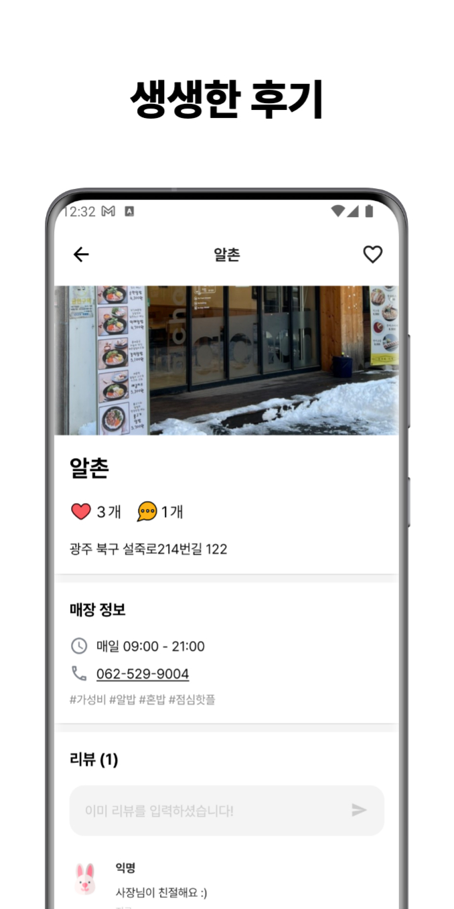

# **전대밥토끼**

 

## 📌 전대밥토끼란?

> 전남대학교 신입생을 위한 맛집 추천 앱

대학 졸업을 앞둔 시점에, 학교에 갓 입학한 신입생들을 보며 **긍정적인 영향**을 주고 싶었습니다.

**전대밥토끼**는 학교 생활을 오랫동안 하며 알게된 저만의 맛집, 술집, 카페 등의 정보를 전달하는 어플리케이션입니다.

 

## 💁🏻‍♂️ 팀원 및 역할

<table style="width='60%'">
    <th style="text-align:center">
      <a href="https://github.com/nang518" target="_blank">정나영</a>
    </th>
    <th style="text-align:center">
      <a href="https://github.com/younhwan97" target="_blank">조윤환</a>
    </th>
    <tr>
        <td>
            
        </td>
        <td>
            
        </td>
    </tr>
    <tr>
        <td>
            <strong>iOS   Developer</strong>
        </td>
        <td>
            <strong>Android   Developer</strong>
        </td>
    </tr>
</table>

 

## 📸 핵심 기능 사진

<table>
  <tr>
    <td></td>
    <td></td>
    <td></td>
  </tr>
  <tr>
    <td></td>
    <td></td>
  </tr>    
 </table>

 

## 🚀 기술 스택 및 성과

**Android**

- Minimum SDK level 21
- 100% Kotlin + Coroutines + Flow + Retrofit를 이용한 비동기 처리.
- Hilt 의존성 주입
- Jetpack
  + Compose + ViewModel 기반 선언형 프로그래밍
  + DataStore 기반 **로그인 기능** 구현
- 맛집 리스트 조회, 리뷰 작성 및 조회 등 세부 로직에 대한 Use Case 구현
  + God Object 방지, 로직 재사용성 증가
  + 앱 출시 시점 **14개의 Use Case로 세분화**
- **맛집 찜 기능** 구현
- **사용자 리뷰 기능** 구현
- 메인, 맛집 리스트, 맛집 정보 등 모든 UI 구현
- Naver Map API을 이용해 가게 위치 정보 제공
- 기타 사용 라이브러리
  + Landscapist(Glide): 장소 이미지
  + Pager: 장소 이미지 슬라이드
  + Lottie: 로딩 화면

 

**Back-end**

- [https://github.com/younhwan97/eatJNU-server](https://github.com/younhwan97/eatJNU-server)
- Node.js 기반 REST API 서버 개발 및 EC2 배포
  + 맛집 리스트, 맛집 정보, 리뷰, 좋아요 기능과 관련한 API 제공
- MySQL 기반 RDBMS 설계 및 RDS 배포

