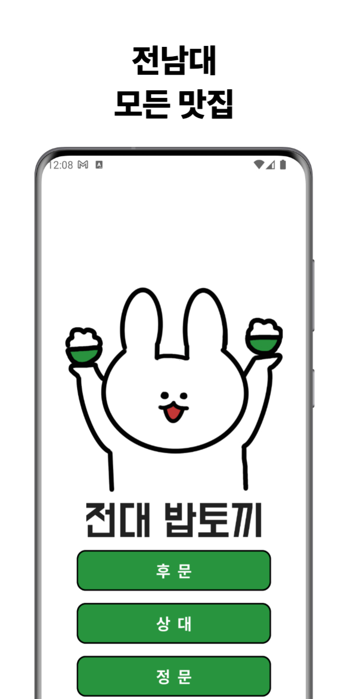

# **전대밥토끼**

 

## 📌 전대밥토끼란?

> 전남대학교 신입생을 위한 맛집 추천 앱

대학 졸업을 앞둔 시점에, 학교에 갓 입학한 신입생들을 보며 **긍정적인 영향**을 주고 싶었습니다.

**전대밥토끼**는 학교 생활을 오랫동안 하며 알게된 저만의 맛집, 술집, 카페 등의 정보를 전달하는 어플리케이션입니다.

 

## 📸 핵심 기능 사진

<table>
  <tr>
    <td></td>
    <td></td>
    <td></td>
  </tr>
  <tr>
    <td></td>
    <td></td>
  </tr>    
 </table>

 

## 🚀 기술 스택 및 성과

- Minimum SDK level 21
- 100% Kotlin + Coroutines + Flow + Retrofit를 이용한 비동기 처리.
- Hilt를 이용한 의존성 주입
- Jetpack
    + Compos
    + ViewModel
    + DataStore - 유저 ID 저장
- Architecture
    + Data layer
    + Domain layer - **유스케이스**를 이용해 재사용 가능한 로직 구현 및 God Object 방지
        * 장소 리스트 조회, 장소 세부 조회, 유저 아이디 조회 및 생성 등 **10개** 이상의 유스케이스
    + Presentation layer
- ..
- ..

<!-- 좋아요, 리뷰, 이미지 스크롤, 필터링?, 네이버 map -->